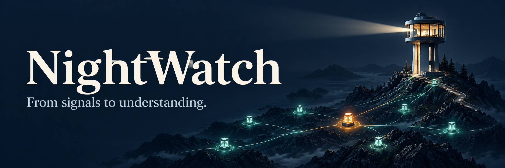
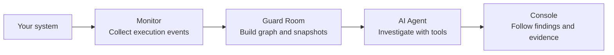

<p align="center">
  
</p>

<h1 align="center">NightWatch</h1>

<p align="center"><strong>From service signals to answers you can trace.</strong></p>

<p align="center">
  <strong>English</strong> · <a href="README.zh-TW.md">繁體中文</a>
</p>

<p align="center">
  <a href="#how-it-works">How it works</a> ·
  <a href="#connect-your-system">Connect your system</a> ·
  <a href="#quick-start">Quick start</a>
</p>

---

NightWatch is an **AI agent for investigating service issues**. It connects service health, logs, and historical snapshots so you can understand what happened, where to look, and what to do next—with evidence behind the findings.

Connect it to your existing system through a monitoring adapter and service mapping. The agent investigates the resulting service graph, so the same workflow can extend across applications and backends. This repository includes a storefront spanning products, carts, checkout, and database operations as an integration example.

## How it works



1. **Observe.** Monitor captures function execution, duration, logs, and exceptions, then sends events through JSONL or HTTP.
2. **Find the signal.** Guard Room maps events to service nodes, calculates health indicators, and saves graph snapshots. Repeated fresh anomalies can trigger an investigation; you can also start one manually.
3. **Investigate.** The agent inspects the graph, compares historical snapshots, reads node details, and searches recent logs to develop evidence-backed hypotheses.
4. **Understand.** Console shows the service graph and streams investigation progress. Findings, supporting evidence, model conversations, and reports are saved for review; the API also supports export.

### Follow a slow checkout

A checkout request takes longer than expected. Monitor records the call duration and related function events. Guard Room marks affected nodes when configured thresholds are met. The agent can then compare the request, checkout logic, and database observations to narrow down where the delay occurred—and record what the evidence does and does not establish.

| You want to know… | NightWatch provides |
| --- | --- |
| Where should I look first? | A service graph with health, traffic, latency, and errors where measured |
| What changed? | Historical graph snapshots and a Console timeline |
| Why does the agent think that? | Tool results, evidence references, and saved model conversations |
| What should we do next? | A structured report with findings, hypotheses, limitations, and next steps |

## Connect your system

The integration boundary is **service signals and a configured graph**. Map your monitors to service nodes, then let the agent query Guard Room through the same investigation tools.

- **Python services:** instrument selected functions with `@monitor(MonitorConfig(...))` and deliver events through JSONL or the background HTTP sink.
- **Other systems:** implement an adapter that sends `nightwatch.log.v1` events to `POST /api/logs`, with a configured `monitor_id` → node mapping.
- **OpenTelemetry (OTel):** an OTel integration would use an adapter to this event format; that adapter and native OTLP ingestion are not included yet.

Start with the [Monitor guide](control/monitor/README.md), [graph configuration](guardroom/README.md), and [HTTP API](control/server/README.md).

## Quick start

You need Git, Docker + Compose, Python 3, curl, and lsof. Run these commands from the repository root:

To enable AI investigation, configure `NIGHTWATCH_LLM_API_KEY` (or `OPENAI_API_KEY`) in your shell **before starting**, or in the Git-ignored `guardroom/.env`. Set `NIGHTWATCH_LLM_ENDPOINT` and `NIGHTWATCH_LLM_MODEL` for your model provider; see the [Agent guide](control/README.md).

```sh
git clone https://github.com/davidleitw/nightwatch-hack.git
cd nightwatch-hack

# Build and start the storefront, Guard Room, and Console.
./restart.sh
```

Initial image pulls and dependency installation may need network access. Once prepared, the local monitoring stack can run offline; AI investigation needs a reachable model endpoint and credentials.

| Open | Default address |
| --- | --- |
| Console — service graph and investigations | http://127.0.0.1:4173 |
| Storefront — generate service activity | http://127.0.0.1:8080 |
| Guard Room — interactive API docs | http://127.0.0.1:9999/docs |

Browse products and use checkout to generate observations. Open Console to inspect the graph and start an investigation after configuring the model.

```sh
# Check service availability and the current graph.
curl --fail-with-body http://127.0.0.1:8080/api/health
curl --fail-with-body http://127.0.0.1:9999/health
curl --fail-with-body http://127.0.0.1:9999/api/graph

# Start using existing Docker images, or stop while preserving data.
# ./restart.sh --open
# ./restart.sh --close
```

The startup script preserves existing host ports; its output lists the actual addresses. Port overrides, data persistence, and deployment settings are in the [deployment guide](guardroom/README.md).

## Project map

| Component | Responsibility |
| --- | --- |
| [Monitor](control/monitor/README.md) | Capture function events and deliver them to Guard Room |
| [Guard Room](guardroom/README.md) | Aggregate signals, maintain the graph, and store snapshots |
| [AI Agent](control/README.md) | Investigate through tools and submit structured reports |
| [Investigation API](control/server/README.md) | Coordinate investigations, persist evidence, and stream updates |
| [Console](console/README.md) | Explore service state, history, and investigation results |
| [Storefront](shop-web/README.md) | An integrated application with gateway, catalog, cart, and order services |

## What's next

Broader telemetry adapters, deeper service coverage, and human-approved repair with post-action verification. Today, the core workflow is **monitoring → investigation → report**. Coverage follows the configured instrumentation; missing measurements remain unknown. General automated repair is future work. See the [integration notes](docs/readme/integration-status.md) for implementation details.

<p align="center"><strong>From signals to understanding.</strong></p>
