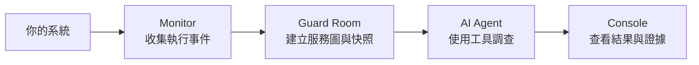

<p align="center">
  
</p>

<h1 align="center">NightWatch</h1>

<p align="center"><strong>從服務訊號，找到有據可查的答案。</strong></p>

<p align="center">
  <a href="README.md">English</a> · <strong>繁體中文</strong>
</p>

<p align="center">
  <a href="#運作方式">運作方式</a> ·
  <a href="#接入你的系統">接入你的系統</a> ·
  <a href="#快速開始">快速開始</a>
</p>

---

NightWatch 是一個**協助調查服務異常的 AI Agent**。它把服務健康狀態、日誌與歷史快照串在一起，幫你理解發生了什麼、該往哪裡查、接下來能做什麼，並為調查結果留下證據。

透過監測轉接與服務映射，可以將 NightWatch 接入既有系統。Agent 依據整理後的服務圖展開調查，同一套流程可延伸到不同應用與後端。這個 repository 以購物網站作為整合範例，串起商品、購物車、結帳與資料庫操作。

## 運作方式

用 12 秒看懂一次調查的流程。

<p align="center">
  
  <br>
  <sub>流程概念動畫 · 發現異常 → 追查證據 → 產出報告 · <a href="docs/readme/nightwatch-workflow.gif">查看原尺寸</a></sub>
</p>

<details>
<summary>展開靜態流程圖</summary>



</details>

1. **收集觀測。** Monitor 記錄函式執行、耗時、日誌與例外，透過 JSONL 或 HTTP 傳送事件。
2. **找出異常。** Guard Room 把事件對應到服務節點，計算健康指標並保存服務圖快照。持續出現的新異常可自動觸發調查，也能手動開始。
3. **展開調查。** Agent 查看服務圖、比較歷史快照、讀取節點詳情與搜尋近期日誌，根據證據提出可能原因。
4. **看懂結果。** Console 呈現服務圖與即時調查進度；發現、證據、模型對話與報告會保存下來，方便回看，也可透過 API 匯出。

### 以結帳變慢為例

一筆結帳請求比預期慢。Monitor 記錄這次呼叫的耗時與相關函式事件；達到設定門檻時，Guard Room 標示受影響節點。Agent 接著比較請求、結帳邏輯與資料庫的觀測，縮小延遲可能發生的位置，並在報告中說明證據支持的判斷與仍待確認的部分。

| 你想知道…… | NightWatch 提供 |
| --- | --- |
| 該先看哪裡？ | 服務圖，以及已量測的健康狀態、流量、延遲與錯誤 |
| 前後有什麼變化？ | 歷史服務圖快照與 Console 時間軸 |
| Agent 為什麼這樣判斷？ | 工具結果、證據引用與保存的模型對話 |
| 接下來能做什麼？ | 包含發現、假設、限制與下一步的結構化報告 |

## 接入你的系統

對接的核心是**服務訊號與設定好的服務圖**。將 monitor 對應到服務節點後，Agent 就能透過相同的調查工具查詢 Guard Room。

- **Python 服務：** 用 `@monitor(MonitorConfig(...))` 標記需要觀測的函式，選擇 JSONL 或背景 HTTP 傳送。
- **其他既有系統：** 實作轉接層，將事件轉成 `nightwatch.log.v1` 送到 `POST /api/logs`，並設定 `monitor_id` → 節點對應。
- **OpenTelemetry（OTel）：** 可透過轉接層對接上述事件格式；目前尚未內建此轉接層與原生 OTLP 接收。

接入細節見 [Monitor 指南](control/monitor/README.md)、[服務圖設定](guardroom/README.md)與 [HTTP API](control/server/README.md)。

## 快速開始

需要 Git、Docker + Compose、Python 3、curl 與 lsof。以下命令從 repository 根目錄執行：

啟用 AI 調查時，請在**啟動前**於 shell 設定 `NIGHTWATCH_LLM_API_KEY`（或 `OPENAI_API_KEY`），也可放入 Git 忽略的 `guardroom/.env`。透過 `NIGHTWATCH_LLM_ENDPOINT` 與 `NIGHTWATCH_LLM_MODEL` 設定模型服務，詳見 [Agent 指南](control/README.md)。

```sh
git clone https://github.com/davidleitw/nightwatch-hack.git
cd nightwatch-hack

# 建置並啟動商店、Guard Room 與 Console。
./restart.sh
```

首次下載映像與安裝依賴可能需要網路；備妥後，本機監測服務可離線運作。AI 調查需要可連線的模型端點與金鑰。

| 開啟入口 | 預設網址 |
| --- | --- |
| Console — 服務圖與調查工作區 | http://127.0.0.1:4173 |
| 商店 — 產生服務活動 | http://127.0.0.1:8080 |
| Guard Room — 互動式 API 文件 | http://127.0.0.1:9999/docs |

瀏覽商品、操作結帳以產生觀測，再打開 Console 查看服務圖；設定好模型後，即可開始調查。

```sh
# 確認服務可用，並取得目前服務圖。
curl --fail-with-body http://127.0.0.1:8080/api/health
curl --fail-with-body http://127.0.0.1:9999/health
curl --fail-with-body http://127.0.0.1:9999/api/graph

# 使用既有 Docker 映像啟動，或停止服務並保留資料。
# ./restart.sh --open
# ./restart.sh --close
```

啟動腳本會沿用既有 host port，實際網址以執行輸出為準。連接埠覆寫、資料保存與部署設定見 [部署指南](guardroom/README.md)。

## 專案導覽

| 元件 | 負責什麼 |
| --- | --- |
| [Monitor](control/monitor/README.md) | 收集函式事件並傳送至 Guard Room |
| [Guard Room](guardroom/README.md) | 彙整訊號、維護服務圖、保存快照 |
| [AI Agent](control/README.md) | 使用工具調查，提交結構化報告 |
| [調查 API](control/server/README.md) | 管理調查、保存證據、推送即時更新 |
| [Console](console/README.md) | 查看服務狀態、歷史快照與調查結果 |
| [購物網站](shop-web/README.md) | 串接 gateway、catalog、cart、order 的應用範例 |

## 接下來

擴充更多觀測來源、加深服務監測覆蓋，並加入人工批准修復與執行後驗證。目前核心流程是**監測 → 調查 → 報告**；觀測範圍取決於已設定的監測點，缺少的量測保留為未知。通用自動修復仍是後續工作，實作細節見 [整合說明](docs/readme/integration-status.md)。

<p align="center"><strong>從看見異常，到理解原因。</strong></p>
