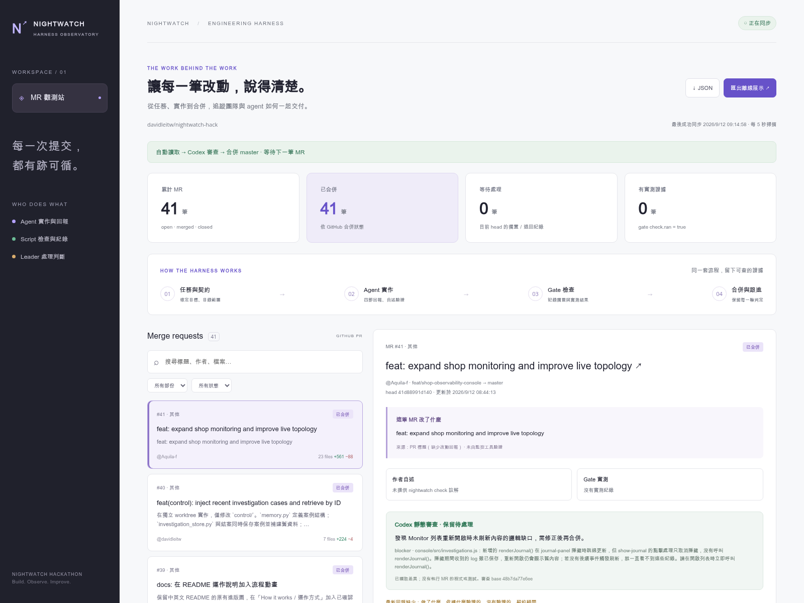
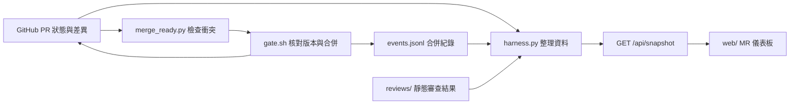

# MR 監控與 Harness 展示

這是 leader 的工具，檔案都放在 `gate/`。MR 對應這個 repo 的 GitHub PR。
使用既有 `gh` CLI、`git`、`bash`、`jq` 與 Python 3 標準函式庫，網頁使用原生 HTML/CSS/JS，直接提供正式靜態資產，不需要套件安裝、開發伺服器或 CDN。




截圖取自本機運行中的儀表板與真實 GitHub MR 資料（2026-09-12）；畫面數字是拍攝當下的狀態。

## 怎麼整合



| 元件 | 工作與資料 |
| --- | --- |
| `harness.py` | 讀取 GitHub PR、逐檔差異、作者回報、gate 事件與審查 JSON，提供 HTTP 頁面與快照。 |
| `web/` | 原生 HTML/CSS/JS；MR 清單、搜尋、篩選、差異、四節回報、歷次判定與 JSON／離線匯出。 |
| `merge_ready.py` | 每輪完成後等待 5 秒，處理目標 `master`、非 draft 且無衝突的 PR。 |
| `automerge.py`、`REVIEW.md` | 可選的 Codex 靜態審查；結果保存至 `reviews/`。目前與直接合併程序並行，審查意見不作直接合併的門檻。 |
| `gate.sh`、`EVENTS.md` | 共用鎖、核對 head/base、合併、確認 GitHub MERGED，再寫事件並嘗試快轉本機 master。 |
| `report.py`、`*.schema.json` | 解析四節回報與定義快照、審查資料格式。 |
| `enter.py`、`ENTRY.md` | Leader / follower 進場入口與共用工作說明。 |

有衝突時 `merge_ready.py` 只記錄並等待，**目前不會自行改程式解衝突**。由 leader 在隔離 worktree 解決並正常推回來源分支後，下輪重新處理。本機未提交修改阻擋快轉時保留原狀，不代表遠端合併失敗。

儀表板頂端的 `automation` 狀態目前來自 `automerge.py`；直接合併程序的心跳與錯誤請看 `state/merge-ready/status.json`。MR 是否真的合併，以 GitHub 狀態和 gate 事件為準。

## 快速啟動

先安裝 Python 3、GitHub CLI、git、bash、jq；執行 `gh auth login`，並確認 repo 根 `hackathon.conf` 的 `REPO`。可選審查流程另外需要已登入的 Codex CLI。

```bash
# 在 repo 根目錄執行，只啟動儀表板
python3 -B gate/harness.py --background
# 開啟 http://127.0.0.1:8787

# 持續自動合併：執行後會實際寫入 GitHub
python3 -B gate/merge_ready.py --background

# 可選：另行產生靜態審查意見
python3 -B gate/automerge.py --background
```

同一程序只啟動一份。要改成每輪等一分鐘，啟動時加 `--interval 60`；查詢、審查或合併時間另計。

`state/`、`logs/`、`events.jsonl`、`reports/`、`reviews/` 是本機執行資料，不隨此資料夾提交。儀表板會從 GitHub 重建 PR 資訊；歷史 gate 判定與模型審查需保留這些本機資料。截圖放在 `screenshots/`，README 可直接在 GitHub 顯示。

## 目前的自動流程

最新操作指示改為「沒有 conflict 就直接 merge」。使用：

```bash
python3 gate/merge_ready.py --background
```

每輪完成後隔 5 秒重新查詢，非 draft 且目標 master 的 MR 沒有衝突就交給 gate 合併；
GitHub 尚未算出合併狀態時等待下一輪。審查、格式、截圖及契約疑問保留為紀錄，
不阻擋此模式；仍遵守 GitHub 分支保護，不跑產品驗證。
此程序與原審查程序共用 gate 合併鎖，MR head 與 master SHA 在合併前再次核對。
原審查程序可以繼續產生意見；布告欄以 GitHub 合併狀態與 gate 事件呈現實際結果。
狀態、PID、log 存在 `gate/state/merge-ready/`；停止方式：
`kill "$(cat gate/state/merge-ready/server.pid)"`。停止時會先完成進行中的 gate 操作。

以下是原本「審查通過才合併」的流程，單獨執行時仍使用原政策。

Leader 已授權：每個 MR 讀取內容、寫上儀表板，沒問題就合併到 master。

```bash
python3 gate/harness.py --background
python3 gate/automerge.py --background
```

第二個背景程序預設每輪完成後等待 5 秒，用既有登入的 Codex 對每個非 draft、目標 master 的 MR 讀取完整 diff，產生 `REVIEW.schema.json` 格式的靜態審查結果，存到 `gate/reviews/`。使用本機 Codex 的模型設定；沒有另安裝套件。審查會使用模型額度。

沒有具體阻擋問題就透過 `gate.sh merge` 合併，GitHub 確認 MERGED 後才記錄合併事件。審查結果、摘要、合併歷程與錯誤都顯示在儀表板。
依 leader 最新指示，分支命名、目錄與四節回報格式不再是此自動流程的門檻。內容問題、實際衝突、失敗或尚未完成的 GitHub checks 才保留處理；不繞過 GitHub 保護規則。

審查綁定 PR head 和當下 master 的真實 ref SHA（不是 PR 建立時的 base SHA）。有新 commit、內文或 master 更新會重新審查。模型讀到的 PR 文字與 diff 都視為資料，不可變成工具執行或合併指令。模型本身在唯讀沙箱中審查；沒有執行產品測試。
審查輸入超過 180KB、取得失敗或模型失敗會在畫面顯示錯誤；不截斷內容後假裝讀完。每次合併後更新 origin/master，並在主工作目錄位於 master 時執行快轉；Git 若拒絕覆蓋本機修改、或分支已分歧，就保留現況。同步結果記在該 MR 的合併事件 note，儀表板可查看。可用 `bash gate/gate.sh sync` 單獨同步。背景程序不留言、不刪分支；合併檢查用 gate/state/automerge/worktree。

停止自動合併：`kill "$(cat gate/state/automerge/server.pid)"`；不影響監控頁。狀態與 log 在 `gate/state/automerge/status.json`、`server.log`。離線匯出仍只展示快照，不會啟動審查或合併。
Codex 非互動 JSON 輸出用法依本機 `codex exec --help` 與 [OpenAI 官方文件](https://learn.chatgpt.com/docs/non-interactive-mode)。

## 開啟持續監控

在 repo 根目錄執行：

```bash
python3 gate/harness.py
```

需要留在背景執行時用 `python3 gate/harness.py --background`，PID 與輸出分別在
`gate/state/harness/server.pid` 和 `server.log`；停止時 `kill "$(cat gate/state/harness/server.pid)"`。
同一個 port 已有程序時不要重啟第二個。

瀏覽器開 `http://127.0.0.1:8787`。預設每輪完成後等 5 秒，再讀取 GitHub 的全部 PR（含已合併、關閉與草稿），以 updated_at、head SHA、base SHA 快取未變動的 PR；分頁讀取檔案。每 1 秒更新網頁。
`--interval` 可調整掃描間隔（最少 5 秒）；實際兩次同步之間還包含 GitHub 查詢所需時間。
自動審查程式 `gate/automerge.py` 的預設掃描間隔也為 5 秒；審查與合併花費的時間另計。
自動審查程式重啟時會保留既有的每筆 PR 審查結果，讓儀表板繼續顯示已合併 PR 的紀錄。
`gh` 沿用本機已登入的 GitHub 身分；repo 讀取 `hackathon.conf` 的 REPO 字面值。`--repo owner/name` 可明確指定。
此程式只對 GitHub 發 GET，不 checkout、不合併、不留言，也不執行 PR 裡的程式。
原有 `bash gate/gate.sh watch` 是會自動合併的另一個流程，需 leader 已授權才執行。

網頁包含每筆 MR 的改動摘要、檔案新增刪除行數、GitHub patch 節錄、最新一輪四節回報、完整歷輪內文及 gate 判定歷程。
摘要是從作者最新一輪「做了什麼」抽取；缺少時用 PR 標題，皆標示來源，不假裝模型做過 code review。
`self_reported.check=pass` 是作者註解；只有同 head 的 `gate.verdict.check.ran=true` 才顯示有實測證據。
舊 head 的 gate 判定保留在歷史，不套到新 commit。合併狀態來自 GitHub，不代表程式驗證通過。

若 GitHub 中斷、權限不足、讀取期间 PR 更新或本機服務停止，畫面顯示錯誤並保留上次資料。從未成功同步時顯示「尚未取得」，不顯示成 0 筆。
每次完整成功同步才覆寫 `gate/state/harness/snapshot.json`。快取錯誤或 repo 不符會明確退出，不靜默清空。
同一 repo 請只啟動一個監控程序；預設 port 重複會失敗。Ctrl-C 停止 HTTP 與輪詢，正在讀取的 gh 也會結束。

## Structured output 與離線展示

```bash
# 同步一次，stdout 是 JSON，進度與錯誤在 stderr
python3 gate/harness.py --once

# 完全不連 GitHub，只展示本機快取
python3 gate/harness.py --offline

# 把最後成功資料打包成單一 HTML，可直接雙擊、離線分享
python3 gate/harness.py --offline --export gate/state/harness/demo.html
```

HTTP `GET /api/snapshot` 與 `GET /snapshot.json` 回傳完整 struct，格式見 `SNAPSHOT.schema.json`；`GET /export.html` 下載單一 HTML。
匯出 HTML 內含資料、樣式與程式，不輪詢、不載入遠端字型、圖片或任何外部腳本；PR 連結只有手動點選才導向 GitHub。
UI 的「↓ JSON」也能下載當前 snapshot。快取與匯出預設位於既有忽略目錄 `gate/state/`。

資料最外層是 `schema_version/repo/generated_at/sync/gate/automation/mrs`。每筆 `mrs[]` 包含：

- `number/title/author/state/draft/branch/sha/part/nn`：PR 識別與目前狀態。
- `summary`：`text/source/verified`，verified 固定 false，表示抽取文字未獨立驗證。
- `files[]`：路徑、原路徑、狀態、行數與 patch；`files_complete=false` 表示 GitHub 回傳不足。
- `report`：最新四節 `latest`、保留輪次的 `rounds`、缺漏 `missing_sections` 與原文 `body`。
- `gate`：同 PR 全部 `history`，目前 head 的 `latest` 跟進、`verdict` 檢查；無事件用 null。
- `review`：該 head 最新 Codex 靜態審查與理由；無審查用 null。`automation` 顯示背景程序的心跳、正在處理的 PR 與錯誤。

`gate.events` 完整保留 `EVENTS.md` 原始欄位。監控程式不寫 events.jsonl；`generated_at` 是展示資料產生時間，GitHub 新鮮度請看 `sync.last_success_at`。
未取得的二進位或大型 patch 用 null；GitHub 提供的 patch 只標示節錄，不聲稱完整 diff。
此版不回溯監控啟動前已消失的 PR head，也不讀取逐行 review comments；gate 已記錄的歷史仍完整展示。

## Leader / follower 同一種進場方式

互動進入 Codex，使用你目前的模型設定，不改全域設定：

```bash
python3 gate/enter.py leader
python3 gate/enter.py follower shop 01
python3 gate/enter.py follower control 02
python3 gate/enter.py follower console 01
```

都會讀 `ENTRY.md` 共用規則，注入角色工作範圍與既有 skill 路徑；follower 另外注入 BRIEF 與指定的任務內容。
若用 Codex App、Claude 或其他介面，加 `--print`，複製輸出進同一 repo 的 session 即可；需要補充目標可加 `--extra '具體目標'`。
follower 的 git 流程仍由人執行：`bash task.sh start 01 shop` → 共用入口 → `bash task.sh submit`；`task.sh fix` 沿用原本批次修復流程。

已存在 `.agents/skills/task-loop/SKILL.md`（follower）及 `gate/SKILL.md` / `.claude/skills/merge-loop/SKILL.md`（leader）；本次直接指定檔案，沒有另安裝同名 skill。
共用 prompt 可直接看 `ENTRY.md`，角色 prompt 用 `--print` 查看。本機 `codex --help` 已列出互動 PROMPT 與 `--cd/--sandbox`。
Skill 的組織方式參照 [OpenAI 官方文件](https://learn.chatgpt.com/docs/build-skills)；入口不假設任意位置的 SKILL.md 都會自動被發現。
